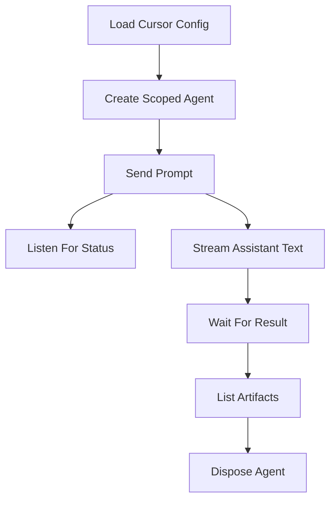

# Basic Agent Workflow

This example shows a full local-agent lifecycle that is still small enough to
read in one sitting:

1. Load Cursor config from the environment.
2. Create a scoped local agent.
3. Send a prompt.
4. Listen for run status changes.
5. Stream assistant text as it arrives.
6. Wait for the final result.
7. List artifacts and optionally download one.



## Prepare

```bash
cd examples/basic-agent-workflow
bun install
cp .env.example .env
export CURSOR_API_KEY="your-key"
export CURSOR_MODEL="composer-2"
export CURSOR_LOCAL_CWD="$(pwd)"
```

## Run

```bash
bun run dev
bun run dev -- "Find one improvement in this example"
bun run dev -- --download-artifact summary.md "Create a summary.md artifact"
```

## Files

- [`src/main.ts`](./src/main.ts) wires the Effect program.
- [`src/format.ts`](./src/format.ts) keeps terminal rendering helpers separate
  from Cursor operations.

## What this showcases

- `CursorAgentService.scoped` for automatic disposal.
- `CursorRunService.streamEvents`, `wait`, `onDidChangeStatus`, `supports`,
  and `unsupportedReason`.
- `CursorArtifactService.listArtifacts` and `downloadArtifact`.
- Config-first SDK option construction with `loadCursorConfig` and
  `agentOptionsFromConfig`.
